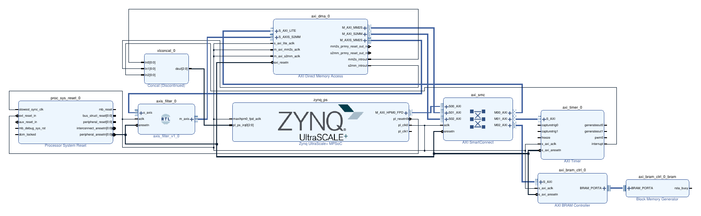

# Design Creation Prototype

**Category:** Design Capture
Hardware-spec-driven block design assembly — the AI implements, the engineer specifies.

## Overview

This example demonstrates a **spec-driven design creation** workflow: you write a hardware specification and provide custom RTL — then a single prompt builds the entire Vivado project, block design, and bitstream from scratch.

The target design is a **DMA loopback via BRAM** on the AMD Kria KV260. Data is written to PL BRAM by the CPU, transferred through AXI DMA and a custom AXI-Stream filter, and written back to a different BRAM region. Verification uses only `devmem2` — no kernel drivers, no external I/O, no PMOD required.

## What's Included

```
design-creation-prototype/
├── spec/
│   └── hardware_spec.md    # Hardware specification (engineer-authored)
├── src/
│   └── axis_filter.v       # Custom AXI-Stream passthrough filter (28 lines)
└── prompts.md               # Full prompt library
```

**The AI generates everything else** — Vivado project, block design, connection automation, HDL wrapper, synthesis, implementation, and bitstream.

## Step-by-Step Instructions

### Step 1 — Open the example

Open the `design-creation-prototype/` folder as your workspace in VS Code or Cursor.

### Step 2 — Verify MCP server is configured

Make sure your MCP configuration points to the Vivado MCP server.

### Step 3 — Run the build prompt

Open your AI agent chat and paste this prompt:

```
Create a Vivado block design for the Kria KV260 according to the hardware
specification in spec/hardware_spec.md.
Add the custom RTL module from src/axis_filter.v as a module reference.
Build through bitstream and report timing.
```

The agent reads the spec and autonomously:

1. Creates a Vivado project targeting `xck26-sfvc784-2LV-c` with the KV260 board preset
2. Builds the IPI block design — instantiates IPs, configures parameters, runs connection automation
3. Adds `axis_filter.v` as a module reference in the AXI-Stream data path
4. Assigns the address map, validates the design
5. Generates the HDL wrapper
6. Runs synthesis, implementation, and writes the bitstream

### Step 4 — Review results

The agent produces a block design like this:



**IP components:**

- **Zynq UltraScale+ PS** — board preset applied, M_AXI_HPM0_FPD enabled, pl_clk0 @ 100 MHz
- **AXI DMA** — 64-bit data, simple mode (no scatter-gather), DRE enabled
- **axis_filter** — your custom RTL module reference in the MM2S → S2MM loopback path
- **AXI BRAM Controller + Block Memory** — 16 KB shared buffer for source and destination data
- **AXI SmartConnect** — 3 SI × 3 MI (PS + DMA masters → DMA regs, Timer, BRAM)
- **AXI Timer** — interval timer with interrupt
- **Concat** — aggregates DMA and Timer interrupts → `pl_ps_irq0`

**Address map:**

| Peripheral | Base Address | Size | Accessed By |
|------------|-------------|------|-------------|
| AXI DMA | `0xA000_0000` | 64 KB | CPU only |
| AXI Timer | `0xA001_0000` | 64 KB | CPU only |
| AXI BRAM | `0xA002_0000` | 16 KB | CPU + DMA MM2S + DMA S2MM |

**Expected timing (KV260 @ 100 MHz):**

| Metric | Value |
|--------|-------|
| WNS | +5.488 ns |
| WHS | +0.011 ns |
| Errors | 0 |
| Critical Warnings | 0 |

### Step 5 — Load bitstream on KV260

Copy the `.bit.bin` to the board and load it via the FPGA manager:

```bash
# From your workstation
scp build/*.bit.bin ubuntu@<KV260_IP>:/home/ubuntu/

# On the KV260
sudo mkdir -p /lib/firmware
sudo cp /home/ubuntu/*.bit.bin /lib/firmware/
echo 0 | sudo tee /sys/class/fpga_manager/fpga0/flags
echo "kv260_dma_bram.bit.bin" | sudo tee /sys/class/fpga_manager/fpga0/firmware
```

### Step 6 — Verify DMA loopback on hardware

You can also ask the agent to generate a verification sequence by pasting this prompt:

```
The bitstream is loaded on the KV260. What devmem2 commands should I run
to test the DMA loopback through BRAM?
```

Or run these commands directly:

**Write test data to BRAM source region (base + 0x0000):**

```bash
sudo devmem2 0xA0020000 w 0xDEADBEEF   # offset 0x00
sudo devmem2 0xA0020008 w 0x12345678   # offset 0x08
sudo devmem2 0xA0020010 w 0xCAFEBABE   # offset 0x10
sudo devmem2 0xA0020018 w 0xA5A5A5A5   # offset 0x18
```

**Configure and start the DMA transfer:**

```bash
sudo devmem2 0xA0000000 w 0x00000004   # MM2S reset
sudo devmem2 0xA0000030 w 0x00000004   # S2MM reset
sudo devmem2 0xA0000000 w 0x00000001   # MM2S run
sudo devmem2 0xA0000030 w 0x00000001   # S2MM run
sudo devmem2 0xA0000048 w 0xA0021000   # S2MM dest = BRAM + 0x1000
sudo devmem2 0xA0000018 w 0xA0020000   # MM2S source = BRAM + 0x0000
sudo devmem2 0xA0000058 w 32           # S2MM length = 32 bytes
sudo devmem2 0xA0000028 w 32           # MM2S length (starts transfer)
```

**Read back from BRAM destination region (base + 0x1000):**

```bash
sudo devmem2 0xA0021000 w   # expect 0xDEADBEEF
sudo devmem2 0xA0021008 w   # expect 0x12345678
sudo devmem2 0xA0021010 w   # expect 0xCAFEBABE
sudo devmem2 0xA0021018 w   # expect 0xA5A5A5A5
```

If the readback values match, the full data path is verified: CPU → BRAM → DMA MM2S → `axis_filter` → DMA S2MM → BRAM → CPU.

!!! warning "BRAM Access Alignment"
    The BRAM controller uses 64-bit data width. Use **8-byte aligned addresses only** (0x0, 0x8, 0x10, …). Accesses to 4-byte-only-aligned addresses (0x4, 0xC, …) cause Bus Errors.

## What You'll Learn

- How a **hardware specification drives AI design creation** — you define what IPs, parameters, and address maps you want; the agent translates that into the right sequence of Tcl commands
- How a single prompt handles the full flow: project creation → IP instantiation → connection automation → address assignment → synthesis → implementation → bitstream
- How **spec quality determines output quality** — explicit IP parameters, address maps, and data path descriptions produce a bitstream that works on first silicon with no manual fixups
- Why **BRAM-based DMA buffers** bypass `CONFIG_STRICT_DEVMEM` restrictions on Kria Ubuntu images, enabling simple `devmem2`-based hardware verification

!!! note "Scope: Standard IPs Only"
    This example uses **well-documented, standard IPs** (AXI DMA, BRAM Controller, Timer)
    whose parameters are straightforward and have no complex interdependencies. A precise
    hardware spec is sufficient for the AI to configure them correctly on the first attempt.

    For designs that use **complex IPs** — such as MRMAC, CMAC, XDMA, Versal CIPS, or DDR4
    MIG — this spec-only approach is **not recommended**. These IPs have encrypted validation
    logic, device-specific GT quad locations, and deeply interdependent parameters that cannot
    be reliably inferred from documentation alone. AMD is investigating development of
    scalable **IP Configurator** and **IP Connectivity** skills to address these complex IPs
    in a future release.

<p class="sphinxhide" align="center"><sub>Copyright © 2026 Advanced Micro Devices, Inc</sub></p>
<p class="sphinxhide" align="center"><sup><a href="https://www.amd.com/en/corporate/copyright">Terms and Conditions</a></sup></p>
