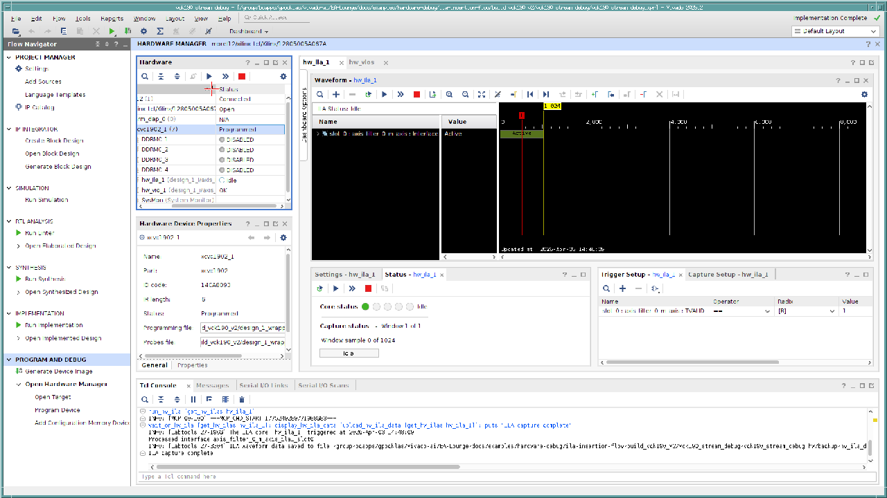

# ILA & VIO Insertion Flow

**Category:** Hardware Debug | **Board:** AMD Versal VCK190 | **Time:** ~15 minutes

> Insert AXIS-ILA and AXIS-VIO debug cores into a Versal block design using only natural-language prompts. Capture AXI-Stream waveforms and control/monitor signals live via JTAG — no manual IP configuration required.

---

## What You'll Build

A PL-only free-running AXI-Stream pipeline on the VCK190 — no PS data paths, no DMA, no DDR. All interaction happens through JTAG debug cores inserted by the AI agent:

```
axis_stream_source ──AXIS──▶ axis_filter ──AXIS──▶ AXI4-Stream Data FIFO
        ▲                        ▲           │
   VIO outputs:             VIO output:     ILA monitors
   - stream_enable          - bypass_enable  this interface
   - pattern_sel[1:0]
                                        VIO input:
                                        - packet_count[31:0]
```

Two bundled skills (`bd-ila-insertion` and `bd-vio-insertion`) teach the agent the correct Vivado parameter sequences, connection patterns, and Versal-specific requirements — like using AXIS-ILA/VIO instead of System ILA/VIO, and routing the JTAG debug path through the AXI Debug Hub and NoC.

## Prerequisites

- VS Code with Vivado MCP Server extension connected
- Vivado 2025.1+ installed and licensed for Versal
- (For hardware test) VCK190 board connected via JTAG

## What's Included

```
ila-insertion-flow/
├── .claude/
│   └── skills/
│       ├── bd-ila-insertion/SKILL.md   # Agent skill for ILA insertion
│       └── bd-vio-insertion/SKILL.md   # Agent skill for VIO insertion
├── spec/
│   └── hardware_spec_vck190.md         # Hardware specification
├── src/
│   ├── axis_stream_source.v            # Free-running AXI-Stream source
│   └── axis_filter.v                   # Passthrough filter with bypass
├── prompts.md                           # All prompts (copy-paste ready)
└── README.md
```

---

## Walk-Through

### Step 1 — Set Up

1. Open the `ila-insertion-flow/` folder as your VS Code workspace.
2. Confirm the Vivado MCP Server is connected (check the status bar).
3. Open the AI agent chat panel.

### Step 2 — Build the Base Design

Copy and paste this prompt into the agent chat:

> **Prompt:**
> ```
> Build the VCK190 project from spec/hardware_spec_vck190.md
> with RTL sources from src/. Run through synthesis only.
> ```

**What the agent does:** It reads the hardware spec, creates a Vivado project targeting the VCK190 (`xcvc1902-vsva2197-2MP-e-S`), adds the two RTL files as module references, and builds a block design with:

- **CIPS** — clock and reset only (100 MHz `pl0_ref_clk`)
- **AXI NoC** — provides the JTAG-to-PL debug path
- **AXI Debug Hub** — debug core discovery infrastructure
- **proc_sys_reset** — synchronized reset
- **axis_stream_source** → **axis_filter** → **axis_data_fifo** — the streaming pipeline

The agent validates the BD, creates an HDL wrapper, and runs synthesis.

**Expected result:** Synthesis completes with no errors. The base block design looks like this:


---

### Step 3 — Insert the VIO

The pipeline is built but we have no way to control it. We'll add a VIO to drive the enable/control signals and monitor packet count — all without touching the Vivado GUI:

> **Prompt:**
> ```
> Insert an AXIS-VIO to control and monitor the streaming pipeline.
> Output probes: stream_enable (1-bit, init 0), pattern_sel (2-bit, init 0),
> bypass_enable (1-bit, init 1). Input probe: packet_count (32-bit).
> Validate the design.
> ```

**What the agent does:** It triggers the `bd-vio-insertion` skill, which:

1. Creates an **AXIS-VIO** (`axis_vio:1.0`) with 3 output probes and 1 input probe
2. Connects the probes to the pipeline:
    - `probe_out0` → `axis_stream_source_0/stream_enable` (start/stop the source)
    - `probe_out1` → `axis_stream_source_0/pattern_sel` (change data pattern)
    - `probe_out2` → `axis_filter_0/bypass_enable` (gate data flow)
    - `axis_stream_source_0/packet_count` → `probe_in0` (monitor throughput)
3. Connects the VIO clock to `pl0_ref_clk`
4. Validates the block design

**Expected result:** Validation succeeds. The block design now includes the VIO:


---

### Step 4 — Insert the ILA

Now we'll add an ILA to capture live AXI-Stream waveforms at the filter output. This is the core debug instrumentation step:

> **Prompt:**
> ```
> Insert an AXIS-ILA on the AXI-Stream interface between axis_filter
> and the FIFO. Use 1024 sample depth. Validate the design.
> ```

**What the agent does:** It triggers the `bd-ila-insertion` skill, which:

1. Creates an **AXIS-ILA** (`axis_ila:1.0`) and sets `C_MON_TYPE` = `Interface_Monitor` (the key Versal parameter that exposes the `SLOT_0_AXIS` interface pin)
2. Configures `C_SLOT_0_INTF_TYPE` = `xilinx.com:interface:axis_rtl:1.0`
3. Connects `SLOT_0_AXIS` to the AXI-Stream net between `axis_filter_0/m_axis` and `axis_data_fifo_0/S_AXIS`
4. Connects clock and reset
5. Validates the block design

**Expected result:** Validation succeeds. The design now has both VIO and ILA debug cores connected.

---

### Step 5 — Build the PDI

With all debug cores in place, generate the programmable device image:

> **Prompt:**
> ```
> Generate output products, implement, and generate PDI. Report timing.
> ```

**What the agent does:** Generates output products for all IPs (OOC synthesis), runs implementation (`opt_design` → `place_design` → `route_design`), writes the PDI and debug probes `.ltx` file, and reports timing.

**Expected result:**

| Metric | Value |
|--------|-------|
| Target Device | xcvc1902-vsva2197-2MP-e-S |
| Clock | 100 MHz (`pl0_ref_clk`) |
| WNS (Setup) | +6.132 ns |
| WHS (Hold) | +0.017 ns |
| Timing | All constraints met |
| PDI Size | ~1.5 MB |

---

### Step 6 — Hardware Test

Program the VCK190 and verify the debug cores are working. You can do this from the agent chat or directly in Vivado Hardware Manager.

**Test 1 — Enable the stream**

> Set `stream_enable=1` via the VIO. Watch `packet_count` start incrementing.

**Test 2 — Block data flow**

> Set `bypass_enable=0`. The filter blocks all packets — verify `packet_count` stops.

**Test 3 — Resume and capture**

> Set `bypass_enable=1` to resume flow. Trigger the ILA on `TVALID=1` to capture AXI-Stream waveforms.

The ILA captures the incrementing counter data pattern flowing through the pipeline:



**Results:**

| Test | Expected | Result |
|------|----------|--------|
| `stream_enable=0` → `packet_count` is 0 | Count stays at 0 | **PASS** |
| `stream_enable=1` → packets flowing | Count increments (~0x6A000/sec) | **PASS** |
| `bypass_enable=0` → data blocked | Count stops | **PASS** |
| `bypass_enable=1` → data resumes | Count resumes | **PASS** |
| ILA trigger on TVALID=1 | Captured incrementing TDATA | **PASS** |

**Sample ILA capture data:**

| Sample | TDATA (hex) | TVALID | TREADY | TKEEP |
|--------|-------------|--------|--------|-------|
| 0 | `000000012659d3c5` | 1 | 1 | `ff` |
| 1 | `000000012659d3c6` | 1 | 1 | `ff` |
| 2 | `000000012659d3c7` | 1 | 1 | `ff` |
| ... | (incrementing +1) | 1 | 1 | `ff` |

---

## Shortcut: Single-Prompt Build

If you prefer to run everything in one shot, use the end-to-end prompt from `prompts.md`:

> **Prompt:**
> ```
> Build the VCK190 project from spec/hardware_spec_vck190.md with RTL from src/.
> Insert AXIS-VIO (stream_enable, pattern_sel, bypass_enable outputs; packet_count input).
> Insert AXIS-ILA on the filter→FIFO AXI-Stream interface, 1024 depth.
> Build through PDI and report timing.
> ```

The agent performs all four steps sequentially and delivers a ready-to-program PDI with both debug cores.

---

## Debug Core Reference

| Parameter | AXIS-VIO | AXIS-ILA |
|-----------|----------|----------|
| IP | `axis_vio:1.0` | `axis_ila:1.0` |
| Monitor Type | — | `C_MON_TYPE` = `Interface_Monitor` |
| Slot 0 Interface | — | AXI-Stream (`axis_rtl:1.0`) |
| Monitored Net | — | `axis_filter_0/m_axis` → `axis_data_fifo_0/S_AXIS` |
| Output Probes | 3 (stream_enable, pattern_sel, bypass_enable) | — |
| Input Probes | 1 (packet_count, 32-bit) | — |
| Sample Depth | — | 1024 |
| Clock | `pl0_ref_clk` (100 MHz) | `pl0_ref_clk` (100 MHz) |

## What You'll Learn

- How to **insert debug cores into Block Designs** using natural-language prompts — no manual IP catalog browsing or connection wiring
- How the bundled skills handle **Vivado parameter sequencing** (create → configure → connect → validate) and Versal-specific constraints
- The difference between **AXIS-VIO** (runtime control/monitor) and **AXIS-ILA** (waveform capture) debug strategies
- How **interface monitoring** captures full AXI-Stream protocol (TDATA, TVALID, TREADY, TKEEP, TLAST) in a single ILA slot
- How debug core insertion affects **timing and resources** — and why the impact is minimal for typical configurations

<p class="sphinxhide" align="center"><sub>Copyright © 2026 Advanced Micro Devices, Inc</sub></p>
<p class="sphinxhide" align="center"><sup><a href="https://www.amd.com/en/corporate/copyright">Terms and Conditions</a></sup></p>
